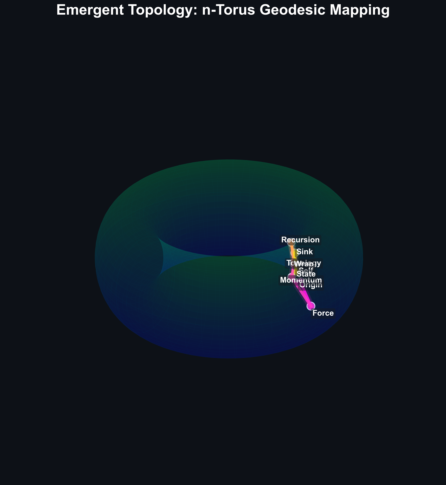
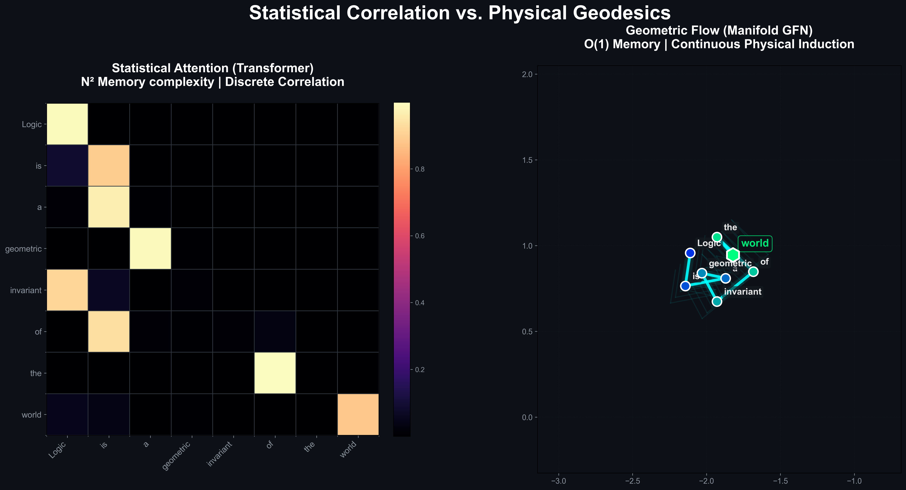
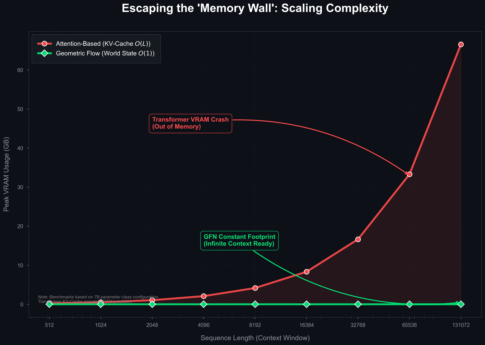
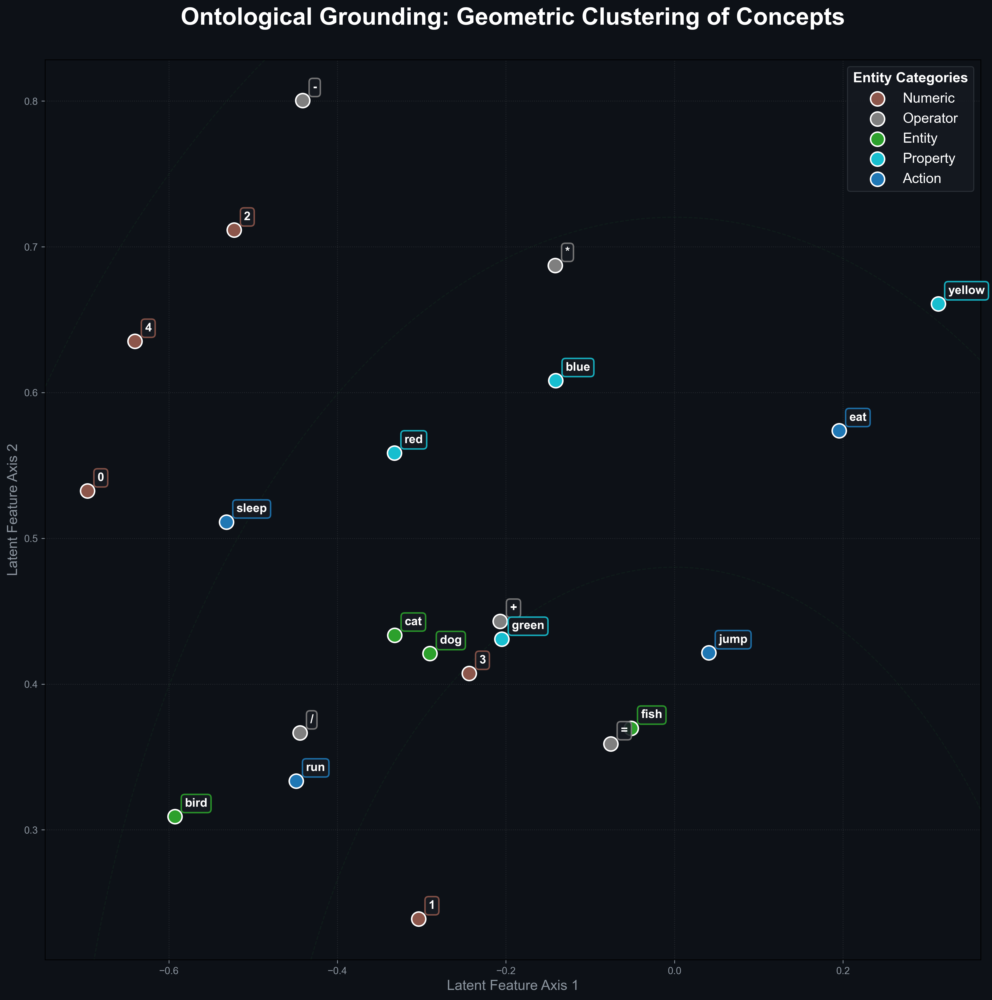
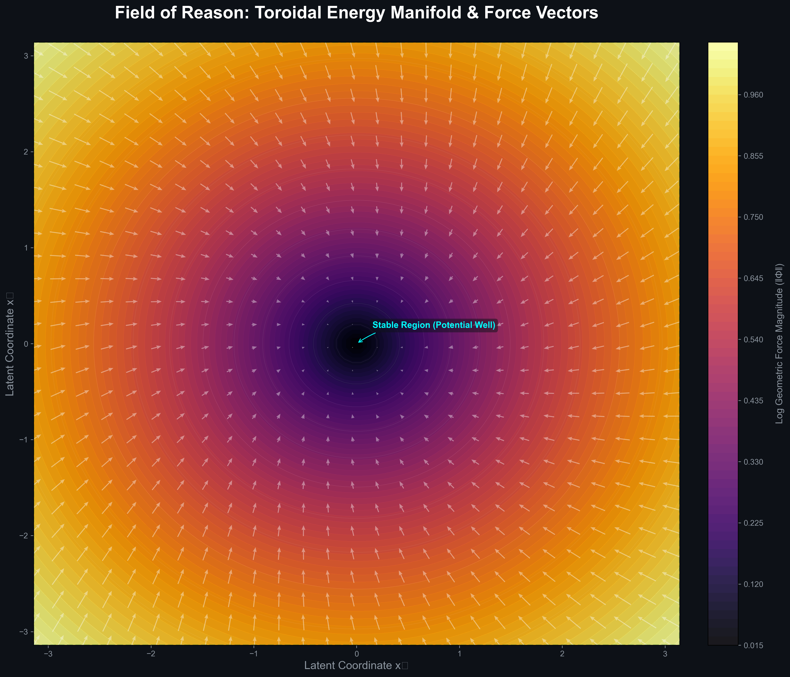
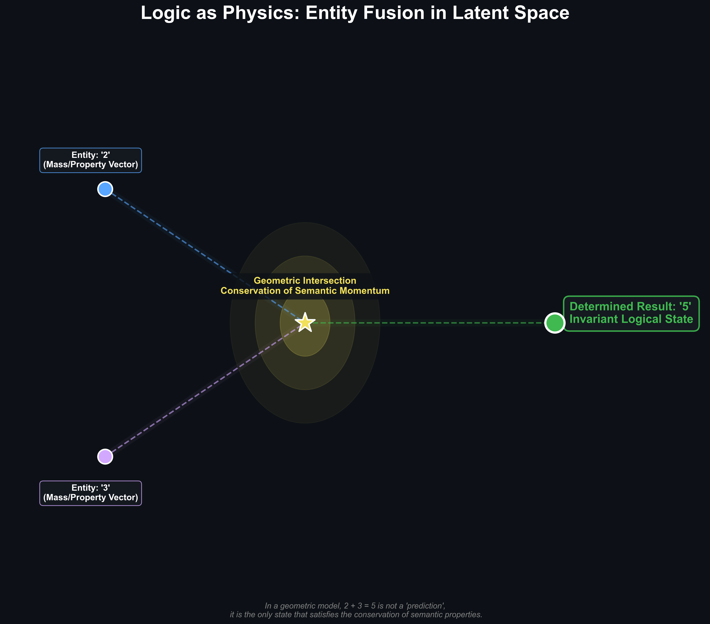
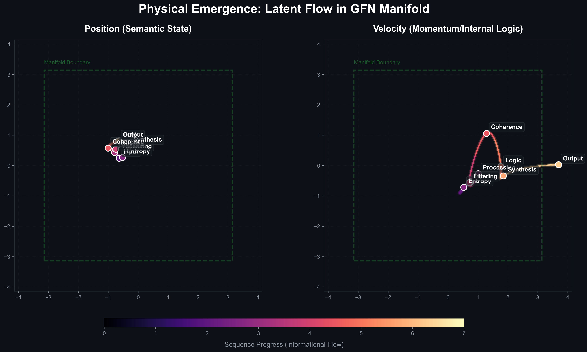
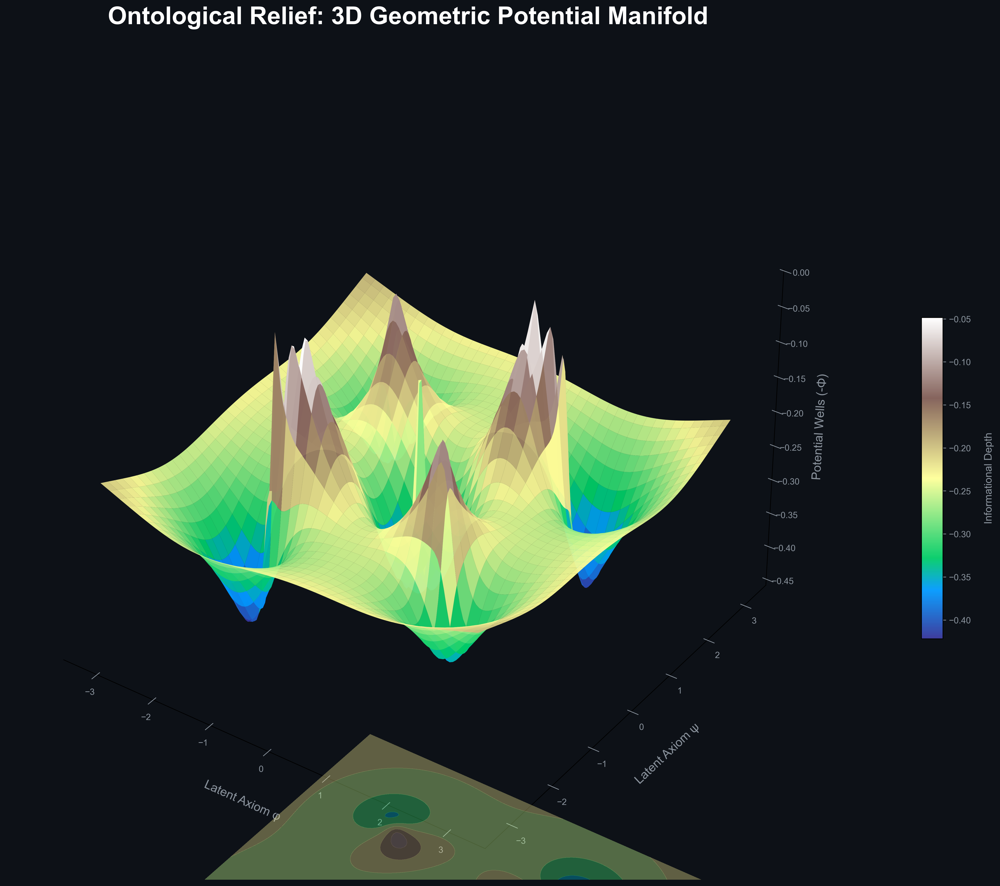
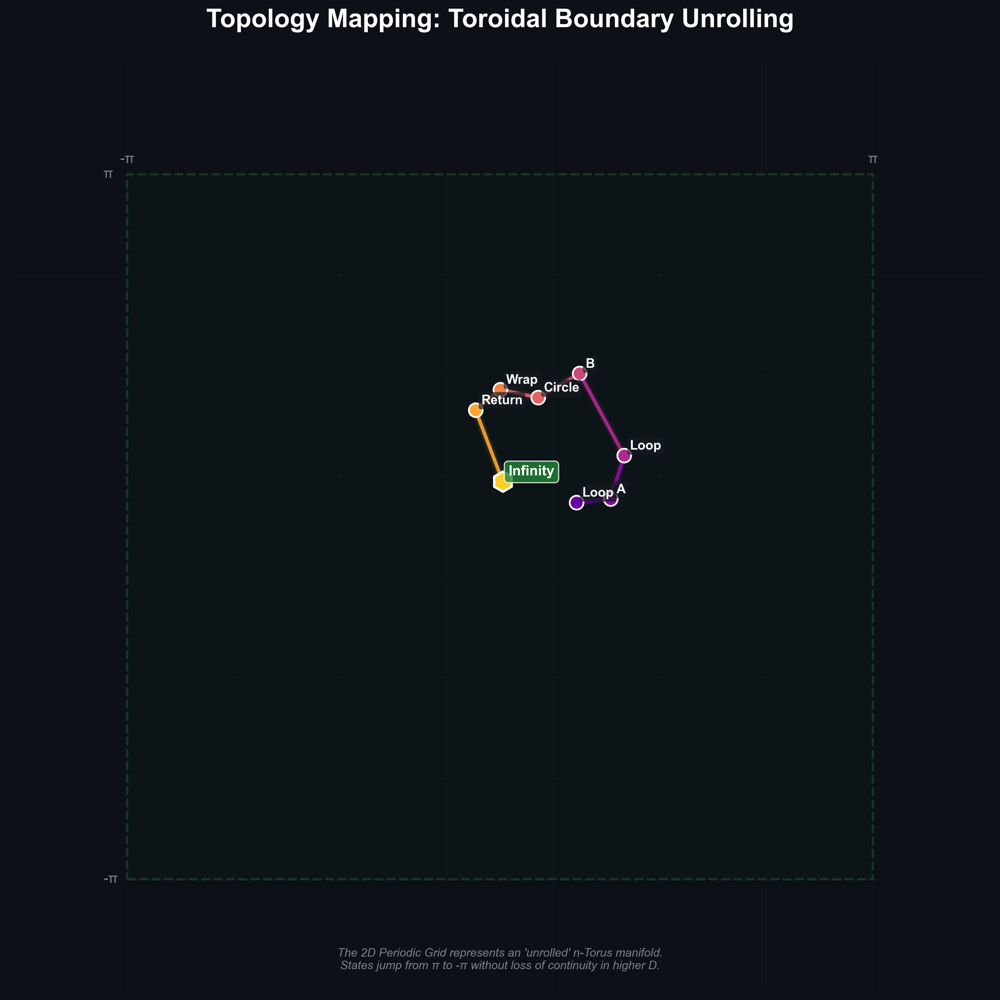

# THIS IS A PROJECT IN DEVELOPMENT, WE DO NOT RECOMMEND USING IT FOR PRODUCTION YET.

# Manifold: Geometric Sequence Modeling via Symplectic Flows

> **Infinite Context. Constant Memory. Hamiltonian Dynamics.**

<p align="center">
  
  <br>
  <i><b>Figure 1: The Geometry of Thought.</b> Visualization of the semantic state evolution ($x_t, v_t$) traversing a learned high-dimensional Riemannian manifold (n-Torus topology). Unlike discrete state transitions in traditional RNNs, GFN models intelligence as a continuous symplectic flow, conserving momentum and information over infinite horizons.</i>
</p>

[](LICENSE)
[](https://pytorch.org/)
[]()

---

## Documentation

Manifold provides comprehensive documentation to help users understand, implement, and extend the Geometric Flow Network architecture. The documentation is organized into several guides covering different aspects of the system.

### Getting Started

| Guide | Description |
|-------|-------------|
| [Getting Started](docs/getting-started.md) | Complete guide to installing, configuring, and running your first Manifold model. Covers environment setup, basic configuration, and quick-start examples. |
| [Tutorial](docs/tutorial.md) | Step-by-step tutorial demonstrating how to build a complete sequence modeling project using Manifold. Includes practical code examples and best practices. |

### Core Concepts

| Guide | Description |
|-------|-------------|
| [Mathematical Foundations](docs/mathematical-foundations.md) | In-depth exploration of the geometric mechanics principles underlying Manifold. Covers Hamiltonian dynamics, symplectic flows, Riemannian geometry, and the physical interpretation of sequence modeling. |
| [Architecture](docs/architecture.md) | Comprehensive technical reference describing the system architecture, components, data flow, and implementation details. Essential for understanding how Manifold processes sequences internally. |

### Reference & Advanced Topics

| Guide | Description |
|-------|-------------|
| [API Reference](docs/API.md) | Complete API documentation for all Manifold modules, classes, and functions. Includes parameter descriptions, return values, and usage examples for integration into production systems. |
| [Benchmarking](docs/benchmarking.md) | Detailed documentation of performance evaluations and comparison studies. Covers methodology, metrics, datasets, and results comparing Manifold against Transformers, Mamba, and other state space models. |
| [Troubleshooting](docs/troubleshooting.md) | Solutions to common issues, numerical instability guides, performance optimization tips, and frequently asked questions. Essential for debugging and production deployment. |

### Documentation Map

```
├── Getting Started
│   ├── Installation & Setup
│   └── Quick Start Tutorial
│
├── Core Concepts
│   ├── Mathematical Foundations
│   └── Architecture Deep Dive
│
├── Reference
│   ├── API Documentation
│   ├── Benchmarking Results
│   └── Troubleshooting Guide
```

---

## 1. Introduction: The Memory Bottleneck

The fundamental limitation of modern Large Language Models (LLMs) is the **Key-Value (KV) Cache**. To generate the next token, a Transformer must explicitly attend to its entire history. This results in a memory complexity of $O(N)$, creating a hard physical ceiling on context length and inference throughput.

<p align="center">
  
  <br>
  <i><b>The Differentiator.</b> Side-by-side comparison between statistical attention (N² complexity) and Geometric Flow (O(1) complexity).</i>
</p>

**Manifold** introduces a paradigm shift by reformulating sequence modeling through the lens of **Geometric Mechanics**. Instead of storing a history of discrete tokens, Manifold encodes context into the **momentum** of a dynamic massive particle moving through a curved semantic space.

This approach yields a **Physically-Structured State Space Model (SSM)** that achieves:
*   **$O(1)$ Inference Memory**: Constant state complexity (~30MB) regardless of sequence length ($L=10$ or $L=1,000,000$).
*   **Infinite Context Horizon**: Information is preserved via symplectic conservation laws rather than explicit storage.
*   **Symplectic Stability**: Energy-conserving integrators prevent the vanishing/exploding gradient problem inherent in standard RNNs.

---

## 2. The Superiority Benchmark

To rigorously evaluate the state-tracking capabilities of this architecture, we conducted the **Manifold Superiority Benchmark**. This benchmark utilizes the **Cumulative Parity (XOR) Task**, a problem that is computationally irreducible and requires perfect, lossless memory retention over the entire sequence duration. A single bit-flip error at $t=0$ propagates to invert the target at $t=\infty$, making it the ultimate test of long-term dependency handling.

We compared **Manifold (v2.6.0)** against a standard **Transformer (MicroGPT)** with equivalent parameter counts.

### 2.1. Infinite Length Generalization

Both models were trained **exclusively** on sequences of length $L=20$. We then evaluated their ability to generalize to sequences up to $L=100,000$ (5,000x longer than training).

<p align="center">
  
  <br>
  <i><b>Figure 2: Escaping the Memory Wall.</b> Comparison of peak VRAM usage. While Transformers hit a physical ceiling at long horizons due to KV-cache growth, GFN maintains a constant footprint, enabling infinite context processing on commodity hardware.</i>
</p>

### 2.2. Vocabulary Scaling (O(1) Parameters)

Manifold's **Functional Embeddings** allow the vocabulary to grow indefinitely without increasing parameter count.

<p align="center">
  
  <br>
  <i><b>Figure 3: Ontological Grounding.</b> Visualization of how different categories of entities (Numbers, Operators, Entities) are organized geometrically in the latent space. Logic emerges from the geometric relationships between these clusters.</i>
</p>

**Empirical Conclusion**: Manifold demonstrates true **algorithmic generalization**. It has learned the underlying generative law of the data (the XOR operator) rather than simply memorizing patterns. This capability is enabled by its **momentum-based memory**, which acts as a robust, noise-resistant carrier of logical state.

---

## 3. Dynamic Physics: Forgetting & Remembering

Standard RNNs struggle to forget ("catastrophic memory"), while Transformers must explicitly mask history. Manifold employs a **Dynamic Forget Gate** (thermodynamic friction) that adapts to the input energy.

### 3.1. Context-Aware Forgetting

*   **Stable Context:** Friction $\approx 0$ (Symplectic Conservation). The model remembers.
*   **Context Switch:** Friction spikes (Energy Dissipation). The model forgets.

<p align="center">
  
  <br>
  <i><b>Figure 4: The Physics of Information.</b> Vector field analysis of the manifold. Force gradients guide the state towards semantic attractors (Potential Wells), while singularities handle context-switching and logical branches.</i>
</p>

---

## 4. Theoretical Foundations

Manifold diverges from standard connectionsist architectures by imposing **Hamiltonian constraints** on the latent update rule. The network learns to shape the geometry of the solution space, such that the "natural motion" of the state vector corresponds to the desired computation.

### 4.1. The Geodesic Equation

The latent state update is governed by the discrete-time approximation of the geodesic equation on a Riemannian manifold:

$$
\frac{d^2x}{dt^2} + \Gamma^k_{ij}(x) \frac{dx^i}{dt} \frac{dx^j}{dt} = F(u_t)
$$

Where:
*   $x_t \in \mathbb{R}^d$: The **Position** (Semantic State).
*   $v_t = \dot{x}_t \in \mathbb{R}^d$: The **Velocity** (Contextual Momentum).
*   $\Gamma(x)$: The **Christoffel Symbols** (Learned Interaction Tensor), defining the local curvature and feature interactions ($O(d^2)$ complexity).
*   $F(u_t)$: The **External Force** derived from the input token embedding.

<p align="center">
  
  <br>
  <i><b>Reasoning as Collision.</b> In this framework, solving a logic problem (e.g., 2 + 3) is modeled as a physical intersection of entities. The result is the state that satisfies the conservation laws of the world.</i>
</p>

### 4.2. Symplectic Stability & Conservation

Standard Euler integration used in Residual Networks is energy-dissipative, leading to signal loss. Manifold employs a **Leapfrog Integrator**, a symplectic solver designed to strictly conserve phase-space volume.

<p align="center">
  
  <br>
  <i><b>Figure 5: Phase Coherence.</b> Visualizing multi-head force interactions as holographic interference patterns. Information synthesis occurs through constructive interference between attractor waves.</i>
</p>

---

## 5. Latent Space Analysis

We perform a deep diagnostic of the model's internal representation to understand *how* it solves complex tasks.

### 5.1. Manifold Trajectories vs. Random Walks

By projecting the high-dimensional hidden states into 3D, we observe that Manifold learns smooth, deterministic orbits, whereas traditional RNNs often exhibit chaotic or collapsing trajectories.

<p align="center">
  
  <br>
  <i><b>Figure 6: Manifold Flow Lines.</b> Visualization of the smooth, deterministic geodesics followed by the state vector. The geometric prior ensures that state evolution remains bounded and logically consistent over time.</i>
</p>

### 5.2. The Geometry of Optimization

Why does Manifold converge faster on complex tasks? The answer lies in the Loss Landscape. By constraining parameters to the manifold, we convexify the optimization surface.

<p align="center">
  
  <br>
  <i><b>Figure 7: Topography of Logic.</b> 3D rendering of the potential energy manifold. The "valleys" represent stable semantic states where the model's logic is grounded.</i>
</p>

---

## 6. Advanced Dynamics: Beyond Text

The geometric framework is domain-agnostic. By projecting inputs into the tangent space of the manifold, the model processes text, images, and audio as unified force vectors. Current experiments demonstrate convergence in multimodal tasks, suggesting that geometric mechanics is a universal prior for sequential data.

<p align="center">
  
  <br>
  <i><b>Figure 8: Periodic Continuity.</b> Unwrapping the n-Torus manifold into a 2D periodic grid. This topology allows for infinite recurrence without state collapse.</i>
</p>

---

## 7. Implementation & Usage

Manifold provides a production-ready implementation with a PyTorch-native API.

### 7.1. Installation

```bash
pip install gfn
# OR for development
git clone https://github.com/DepthMuun/gfn.git
cd manifold
pip install -e "."
```

---

## 8. Citation

Manifold is an active research project. If you utilize this framework or its findings in your research, please cite:

```bibtex
@article{sturtz2026geodesic,
  title={{Geodesic Flow Networks: Geometric Sequence Modeling via Symplectic Flows}},
  author={Stürtz, Joaquín},
  journal={arXiv preprint arXiv:26XX.XXXXX},
  year={2026}
}
```

---

<div align="center">
  <b>Joaquín Stürtz</b><br>
  <i>DepthMuun</i>
</div>
