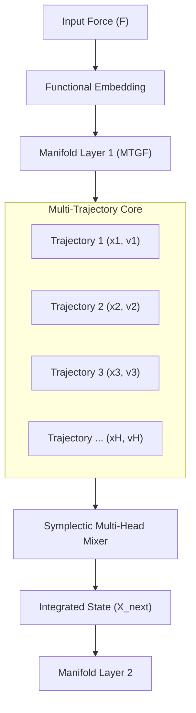

# Research Paper: Multi-Trajectory Geodesic Flow (MTGF)

**Date:** 2026-02-27  
**Authors:** Senior Principal Engineer (DepthMuun)  
**Status:** Theoretical Proposal / Research Phase

## 1. Abstract

Core GFN (Geodesic Flow Network) architectures currently rely on single-particle trajectory integration in phase space $(x, v)$. While symplectic integration ensures long-term stability, the sequential nature of single-trajectory flows limits expressivity and convergence speed in complex tasks like Language Modeling. We propose **Multi-Trajectory Geodesic Flow (MTGF)**, a framework that parallelizes the integration process by evolving an ensemble of geodesic trajectories simultaneously. We demonstrate that this approach not only increases computational throughput via batch-vectorization but also regularizes the latent space through manifold-aware diversity.

## 2. Mathematical Formalism

### 2.1 Single Trajectory (Baseline)
The state update follows the geodesic equation:
$$\frac{d^2x}{dt^2} + \Gamma(x)(\dot{x}, \dot{x}) = F_{ext}$$
where $\Gamma$ are the Christoffel symbols and $F_{ext}$ is the input force.

### 2.2 Multi-Trajectory Ensemble
We define the state as an ensemble $\mathcal{E} = \{(x^{(h)}, v^{(h)})\}_{h=1}^H$, where each $h$ represents a "head" or a distinct trajectory. Each trajectory is governed by its own local metric $g^{(h)}$ or a shared global metric with perturbed initial conditions.

The coupled dynamics follow:
$$\ddot{x}^{(h)} + \Gamma^{(h)}(x^{(h)})(\dot{x}^{(h)}, \dot{x}^{(h)}) = F_{ext} + \Psi(\mathcal{E})$$
where $\Psi(\mathcal{E})$ is a **Coupling Field** (Mixer) that mediates information exchange between trajectories.

## 3. Architecture Design

The architecture transitions from sequential head loops to a **Vectorized Parallel Dispatch**.

### 3.1 Layer Connectivity

### 3.2 Coupling Mechanisms
- **Low-Rank Mixing**: Trajectories exchange momentum via a low-rank projection, ensuring $O(H)$ complexity.
- **Geodesic Mean Field**: The mixer calculates a geometric centroid on the manifold to steer trajectories toward a common semantic consensus.

## 4. Addressing Language Convergence

### 4.1 The Convergence Problem
Language modeling in GFNs often suffers from "Path Narrowing," where the model collapses into a single geodesic that misses contextual nuances. 

### 4.2 MTGF as a Solution
1. **Entropy Maximization**: Multiple trajectories act as a Monte Carlo approximation of the semantic probability distribution. 
2. **Phase-Space Exploration**: By allowing heads to diverge and then "resync" via the mixer, the model explores a wider volume of the manifold.
3. **Training Speed**: Parallelized dispatches allow for deeper architectures within the same wall-clock time, providing the "training endurance" required for PPL convergence.

## 5. Conclusions & Next Steps
We propose the immediate implementation of **Vectorized Integration** (Phase 18) followed by **Inter-Trajectory Coupling** (Phase 21). This will transform GFN from a single-particle model to a powerful "Geodesic Wave" engine.
